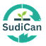

# SudiCan — Sistem Pengelolaan Sampah & Kas Kelas Berkelanjutan

<p align="center">
  
</p>

<p align="center">
  <strong>Solusi digital bank sampah sekolah untuk mengonversi sampah daur ulang menjadi saldo kas kelas dan poin penghargaan lingkungan hidup.</strong>
</p>

---

## 📌 Tentang SudiCan

**SudiCan** (*Sudikah Mendaur?*) adalah platform web manajemen bank sampah di lingkungan sekolah yang menghubungkan partisipasi siswa dan pengawasan guru/administrator sekolah.

Melalui sistem ini:
1. Siswa atau pengurus kelas mengumpulkan dan menyetorkan sampah daur ulang (botol plastik, kertas karton, kaleng logam, dll.).
2. Petugas/guru menimbang dan memvalidasi setoran sampah di sistem.
3. Nilai rupiah dari sampah langsung dikonversi menjadi **Saldo Kas Kelas** serta poin **Green Class** untuk memicu kompetisi positif antarkelas.
4. Kelas dapat mengajukan penarikan dana kas secara transparan melalui sistem untuk kebutuhan kegiatan atau kebersihan kelas.

---

## 🚀 Fitur Utama

### 1. Panel Siswa / Pengurus Kelas (`/student`)
* **Dashboard Interaktif:**
  * Metrik ringkas: Total sampah terkumpul (kg), total kas kelas (Rp), dan peringkat keaktifan kelas.
  * **Kalkulator Estimasi Sampah:** Menggunakan Alpine.js untuk simulasi langsung perhitungan estimasi nilai Rupiah dan poin kas kelas berdasarkan jenis sampah dan berat (kg).
  * **Green Class Leaderboard:** Peringkat kelas teraktif berdasarkan akumulasi poin daur ulang.
  * **Grafik Tren Setoran:** Visualisasi tren akumulasi sampah 4 minggu terakhir menggunakan Chart.js.
* **Waste Deposit:**
  * Rekapitulasi sampah yang telah disetor, filter per periode bulan, serta riwayat penyetoran lengkap beserta nama validator.
* **Cash Report:**
  * Laporan arus kas kelas (pemasukan dari penukaran sampah & pengeluaran penarikan dana).
  * Riwayat transaksi lengkap dengan rincian tanggal, sumber, nominal, dan sisa saldo.
* **Pengajuan Penarikan Dana (`cash-withdrawal`):**
  * Form pengajuan penarikan dana kas kelas (nominal, tujuan penggunaan, tanggal dibutuhkan, dan keterangan).
  * Panduan syarat & ketentuan penarikan kas kelas.

---

### 2. Panel Guru & Admin Pengelola (`/teachers`)
* **Dashboard Monitoring Sekolah:**
  * Ringkasan total sampah terkumpul sekolah, perputaran kas sekolah, jumlah kelas aktif, dan notifikasi pengajuan penarikan yang menunggu validasi.
  * Grafik tren bulanan perputaran sampah sekolah.
  * Daftar kelas teratas (*Top Classes*) dan log aktivitas transaksi terbaru.
* **Waste Deposit (Input Transaksi):**
  * Pencatatan timbangan sampah yang disetor oleh masing-masing kelas.
  * Kalkulasi otomatis preview nominal Rupiah dan poin secara langsung.
* **Cash Report (Validasi Penarikan):**
  * Daftar antrean pengajuan penarikan kas kelas yang berstatus *Pending*.
  * Tombol aksi persetujuan (*Approve*) atau penolakan (*Reject*) penarikan kas kelas.
* **Modul Master Data / CRUD Admin (`teachers/admin`):**
  * **CRUD Kelas:** Tambah kelas baru (`create`), edit data kelas (`edit`), detail informasi kelas & riwayatnya (`show`), serta hapus kelas (`destroy`).
  * **CRUD Manajemen Harga Sampah (`waste-prices`):** Pengaturan daftar jenis sampah, satuan unit (kg/liter), dan harga dasar per satuan.
  * **Manajemen Akun (`accounts`):** Pengelolaan akun pengguna dan hak akses sistem.

---

### 3. Autentikasi & Navigasi (`/auth`)
* **Halaman Register:** Pendaftaran akun dengan antarmuka bertema *forest green* dan ilustrasi maskot SudiCan.
* **Halaman Login:** Masuk menggunakan nama pengguna/email dan kata sandi.
* **Log Out Terintegrasi:** Tombol logout di sidebar langsung mengarahkan pengguna kembali ke alur autentikasi.

---

## 🛠️ Teknologi yang Digunakan

* **Backend Framework:** [Laravel 12](https://laravel.com/) (PHP >= 8.2 / PHP 8.5)
* **Template Engine:** Blade Templating
* **Styling & UI:** [Tailwind CSS](https://tailwindcss.com/)
* **Interaktivitas Frontend:** [Alpine.js](https://alpinejs.dev/) (Kalkulator estimasi & formulir dinamis)
* **Visualisasi Data:** [Chart.js](https://www.chartjs.org/) (Grafik tren setoran & statistik)
* **Database:** MySQL / MariaDB (Dukungan SQLite untuk testing lokal)
* **Development Server:** Laragon / PHP Built-in Server

---

## 📋 Persyaratan Sistem

Sebelum menjalankan aplikasi, pastikan komputer Anda telah terpasang:
* **PHP** versi 8.2 atau yang lebih baru (ekstensi `bcmath`, `ctype`, `fileinfo`, `json`, `mbstring`, `openssl`, `pdo`, `tokenizer`, `xml` aktif).
* **Composer** (Dependency manager untuk PHP).
* **MySQL** / MariaDB (atau Laragon / XAMPP).
* **Git** (opsional).

---

## 💻 Panduan Instalasi & Menjalankan Aplikasi

Ikuti langkah-langkah berikut untuk menjalankan SudiCan di komputer lokal Anda:

### 1. Salin / Buka Proyek
Letakkan folder proyek di web server lokal Anda (misalnya di Laragon: `C:\laragon\www\SudiCan`).

### 2. Pasang Dependensi Composer
Buka terminal (PowerShell atau Git Bash) di direktori proyek, lalu jalankan:
```bash
composer install
```

### 3. Konfigurasi Environment File
Salin file konfigurasi environment dari `.env.example`:
```bash
cp .env.example .env
```
*(Di Windows PowerShell: `copy .env.example .env`)*

Buka file `.env` dan sesuaikan koneksi database Anda:
```env
DB_CONNECTION=mysql
DB_HOST=127.0.0.1
DB_PORT=3306
DB_DATABASE=sudican
DB_USERNAME=root
DB_PASSWORD=
```

### 4. Generate Application Key
```bash
php artisan key:generate
```

### 5. Jalankan Migrasi Database
Pastikan database dengan nama `sudican` sudah dibuat di MySQL, lalu jalankan:
```bash
php artisan migrate
```

### 6. Jalankan Server Lokal

**Jika menggunakan Laragon:**
* Cukup klik tombol **Start All** pada aplikasi Laragon.
* Akses melalui browser pada alamat: [http://sudican.test](http://sudican.test)

**Jika menggunakan `php artisan serve`:**
```bash
php artisan serve
```
* Akses melalui browser pada alamat: [http://localhost:8000](http://localhost:8000)

---

## 🗺️ Peta Rute & Halaman (Daftar URL)

### 🔐 Autentikasi
| Rute | Metode | Nama Rute | Keterangan |
|---|---|---|---|
| `/auth/register` | GET | `auth.register` | Halaman pendaftaran pengguna |
| `/auth/login` | GET | `auth.login` | Halaman login pengguna |
| `/auth/logout` | POST | `auth.logout` | Proses logout |

### 🎓 Panel Siswa
| Rute | Metode | Nama Rute | Keterangan |
|---|---|---|---|
| `/student/dashboard` | GET | `student.dashboard` | Dashboard siswa & kalkulator estimasi |
| `/student/waste-deposit` | GET | `student.deposit` | Riwayat setoran sampah siswa |
| `/student/cash-report` | GET | `student.cash-report` | Laporan kas kelas |
| `/student/cash-withdrawal` | GET | `student.cash-withdrawal` | Form permohonan penarikan kas |

### 👨‍🏫 Panel Guru & Admin
| Rute | Metode | Nama Rute | Keterangan |
|---|---|---|---|
| `/teachers` | GET | `teachers.index` | Dashboard utama pengelola |
| `/teachers/waste-deposit` | GET / POST | `teachers.waste-deposit` | Input transaksi timbangan sampah |
| `/teachers/cash-report` | GET | `teachers.cash-report` | Validasi penarikan kas kelas |
| `/teachers/create` | GET / POST | `teachers.create` | CRUD: Tambah kelas baru |
| `/teachers/{id}` | GET | `teachers.show` | CRUD: Detail kelas & riwayat |
| `/teachers/{id}/edit` | GET / PUT / DEL | `teachers.edit` | CRUD: Edit / Hapus data kelas |
| `/teachers/waste-prices` | GET | `teachers.waste-prices.index` | CRUD: Tabel harga sampah |
| `/teachers/waste-prices/create` | GET / POST | `teachers.waste-prices.create` | CRUD: Tambah harga sampah baru |
| `/teachers/waste-prices/{id}/edit` | GET / PUT / DEL | `teachers.waste-prices.edit` | CRUD: Edit / Hapus harga sampah |
| `/teachers/accounts` | GET | `teachers.accounts` | Manajemen akun |

---

## 📁 Struktur Direktori Penting

```
SudiCan/
├── app/
│   ├── Http/
│   │   └── Controllers/
│   │       ├── AuthController.php      # Controller login, register, dan logout
│   │       ├── StudentController.php   # Controller modul siswa (dashboard, kas, setoran)
│   │       └── TeacherController.php   # Controller modul guru & admin
│   └── Models/
│       └── User.php                    # Model data pengguna
├── public/
│   └── images/                         # Asset gambar, ikon, dan banner SudiCan
├── resources/
│   └── views/
│       ├── auth/
│       │   ├── login.blade.php         # Tampilan halaman login
│       │   └── register.blade.php      # Tampilan halaman register
│       ├── layouts/
│       │   ├── app-admin.blade.php     # Template induk panel guru/admin
│       │   └── student.blade.php       # Template induk panel siswa
│       ├── student/
│       │   ├── dashboard.blade.php     # View dashboard siswa
│       │   ├── waste-deposit.blade.php # View riwayat setoran sampah siswa
│       │   ├── cash-report.blade.php   # View laporan kas siswa
│       │   └── cash-withdrawal.blade.php# View pengajuan penarikan dana
│       └── teachers/
│           ├── index.blade.php         # View dashboard utama guru
│           ├── waste-deposit.blade.php # View transaksi setoran sampah
│           ├── cash-report.blade.php   # View validasi penarikan kas
│           ├── leaderboard.blade.php   # Komponen ranking Green Class
│           └── admin/                  # Sub-direktori khusus fitur CRUD Master Data
│               ├── create.blade.php    # Form tambah kelas
│               ├── edit.blade.php      # Form edit kelas
│               ├── show.blade.php      # Detail kelas
│               ├── waste-prices.blade.php # Tabel master harga sampah
│               ├── waste-price-form.blade.php # Form tambah/edit harga sampah
│               └── accounts.blade.php  # Pengaturan akun
└── routes/
    └── web.php                         # Definisi semua rute web aplikasi
```

---

## 📄 Lisensi

Proyek ini dikembangkan untuk kebutuhan operasional sistem pengelolaan sampah sekolah SudiCan di bawah lisensi terbuka [MIT](LICENSE).
